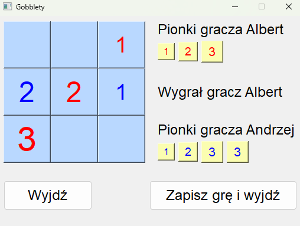

<h2 class="code-line" data-line-start=0 data-line-end=1>Gobblet Gobblers</h2>

This project
    allows to play tic-tac-toe like game Gobblet Gobblers. The main purpose of
    the game is to stack your pieces in one line, however in Gobblet Gobblers
    bigger pieces can be placed over the smaller ones, and pieces that were
    placed on the board can be moved again. These differences are making
    Gobblets much more interesting and difficult than tic-tac-toe. Project was made
    as an assignment for one of the courses during studies.

<h2 class="code-line" data-line-start=2 data-line-end=3>Build
    Status</h2>

Project is
    finished and it is ready to be used.

<h2 class="code-line" data-line-start=4 data-line-end=5>Tech
    used</h2>

Entire project
    was written in python. PyQt library was used for building GUI. Tests were
    written using pytest.

<h2 class="code-line" data-line-start=6 data-line-end=7>Features</h2>

Project allows
    user to configure players names, number of pieces and dimension of the
    board. It is also possible to play against a computer which performs random
    moves. After the end of a match it is possible to save it and then look it
    up in the history of matches. In the history of matches you can see the
    ending state of each saved game.

<h2 class="code-line" data-line-start=8 data-line-end=9>How
    to use</h2>

To play Gobblet
    Gobblers open the <a href="http://main.py">main.py</a> file.

<h2 class="code-line" data-line-start=8 data-line-end=9>Screenshots</h2>

